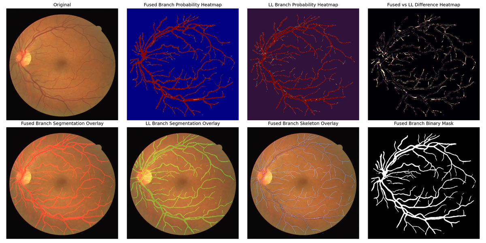

# FRetinalNet — Frequency-Domain Dynamic Convolution for Retinal Vessel Segmentation

[](https://colab.research.google.com/github/SuperXionghaoren/FRetinalNet/blob/main/demo.ipynb)

Official release of our retinal vessel segmentation model on the [DRIVE](https://drive.grand-challenge.org/) dataset.
The model is a dual-branch encoder–decoder network: a ResNet-50 encoder with a **FFTBlock** (Frequency Feature Tuning Block — convolutional kernels parameterized as complex spectral bases with input-adaptive modulation and spectrum refinement) appended to each stage, a fixed Haar dual-tree complex wavelet (DTCWT) input decomposition feeding a second frequency-composite branch, **FaFBlock** (Frequency Aware Fusion Block) for unidirectional frequency-to-spatial cross-branch fusion, and ASPP + dual-resolution decoders with composite (channel/spatial/edge) attention and PixelShuffle upsampling — the architecture described in the paper *"A Frequency-Driven Method for Retinal Vessel Segmentation"*.

This repository provides a runnable, verifiable release of the model:
- `fretinalnet_notebook/` — the model in the paper's terminology (a CI-style [test](tests/test_model_parity.py) verifies the released checkpoint loads with `strict=True` and runs a full 512×512 forward pass);
- `eval_test.py` — a standalone evaluation script for the official DRIVE test protocol;
- pretrained weights hosted on 🤗 Hugging Face (see below).



## Results (DRIVE test split, 20 images)

| ACC | Dice | IoU | AUC | SE | SP | clDice | Conn |
|---|---|---|---|---|---|---|---|
| 0.9703 | **0.8648** | **0.7669** | 0.9421 | 0.8613 | 0.9841 | 0.8935 | 0.9150 |

Evaluation protocol:
- all **20 official DRIVE test images**, resized to 512×512, CLAHE (clip 2.0, 8×8 grid);
- predictions binarized at threshold **0.5**; metrics computed **per image**, then averaged;
- metrics are reported for the main (image-branch) prediction head; the auxiliary frequency-branch head is used only for training supervision and is not evaluated here.

> **Released checkpoint vs. the paper's numbers.** The released `dice_fdconv_drive_ori.pth`
> is the **best checkpoint observed during training** (selected by best validation Dice); evaluated with this repository it gives Dice **0.8648** / IoU 0.7669
> (table above). The DRIVE number reported in the paper (Dice 0.8578) is the **mean over
> three independent runs**, so it is slightly lower than the best single-run checkpoint
> shipped here. Both numbers come from the same architecture and evaluation protocol.


## Interactive demo

[](https://colab.research.google.com/github/SuperXionghaoren/FRetinalNet/blob/main/demo.ipynb)

`demo.ipynb` runs inference end-to-end in a free Colab GPU runtime: it clones the repo,
downloads the weights from Hugging Face, and segments **3 bundled DRIVE test samples**
(`assets/samples/` — metrics + visualization in a single click, no dataset download needed).
The bundled images belong to the DRIVE dataset owners and are included solely for demonstration.

## Quickstart

```bash
# 1) install
pip install -r requirements.txt

# 2) download the pretrained weights (~2.9 GB) from Hugging Face
python scripts/download_weights.py        # -> weights/dice_fdconv_drive_ori.pth

# 3) get DRIVE (registration required) and check the layout
#    https://drive.grand-challenge.org/
python scripts/prepare_drive.py --root data/DRIVE

# 4) evaluate
python eval_test.py --test-root data/DRIVE
```

Expected output:

```
weights: dice_fdconv_drive_ori.pth   (test = all 20 DRIVE test images, threshold 0.5)
  ACC=0.9703, Dice=0.8648, IoU=0.7669, AUC=0.9421, SE=0.8613, SP=0.9841, clDice=0.8935, Conn=0.9150
```

The evaluation is deterministic; on an RTX 4090 it takes ~1 minute (CPU works too, just slower).

## Weights

| File | Size | Purpose |
|---|---|---|
| [`dice_fdconv_drive_ori.pth`](https://huggingface.co/waspwallbvb/FRetinalNet/resolve/main/dice_fdconv_drive_ori.pth) | 2.9 GB | final DRIVE model (used by `eval_test.py`) |
| [`STAGE_FDCONV.pth`](https://huggingface.co/waspwallbvb/FRetinalNet/resolve/main/STAGE_FDCONV.pth) | 794 MB | stage-1 encoder weights (only needed for training) |

Weights are hosted on the Hugging Face repo [`waspwallbvb/FRetinalNet`](https://huggingface.co/waspwallbvb/FRetinalNet);
`scripts/download_weights.py` downloads both files automatically.
If `huggingface.co` is unreachable from your network, set
`HF_ENDPOINT=https://hf-mirror.com` before downloading.

## Repository structure

```
FRetinalNet/
├── eval_test.py                # standalone DRIVE test evaluation
├── fretinalnet_notebook/       # model definition (paper naming)
│   ├── resnet.py               #   ResNet definitions
│   ├── dtcwt.py                #   DTCWT2D fixed wavelet decomposition
│   ├── fft_block.py            #   FFTBlock — Frequency Feature Tuning Block
│   ├── aspp.py                 #   ASPP
│   ├── encoder.py              #   Deconv + ResNetEncoder
│   ├── faf_block.py            #   FaFBlock — Frequency Aware Fusion Block
│   ├── attention.py            #   channel/spatial/edge + CompositeAttention
│   └── model.py                #   FRetinalNet
├── data/drive.py               # DRIVE datasets + CLAHE/resize transforms
├── scripts/
│   ├── download_weights.py     # fetch weights from Hugging Face
│   └── prepare_drive.py        # validate local DRIVE layout
├── tests/test_model_parity.py  # checkpoint strict-load + 512x512 forward test
├── results/eval_results.json   # metrics produced by eval_test.py
└── assets/                     # figures


## Dataset license

The DRIVE dataset (Niemeijer, Staal et al., 2004/2008) is **not** redistributed here. It must be downloaded by each user after registration at [drive.grand-challenge.org](https://drive.grand-challenge.org/).

## License & acknowledgements

Code released under the [MIT License](LICENSE). The ResNet definition in `fretinalnet_notebook/resnet.py` is adapted from [torchvision](https://github.com/pytorch/vision) (BSD 3-Clause).


